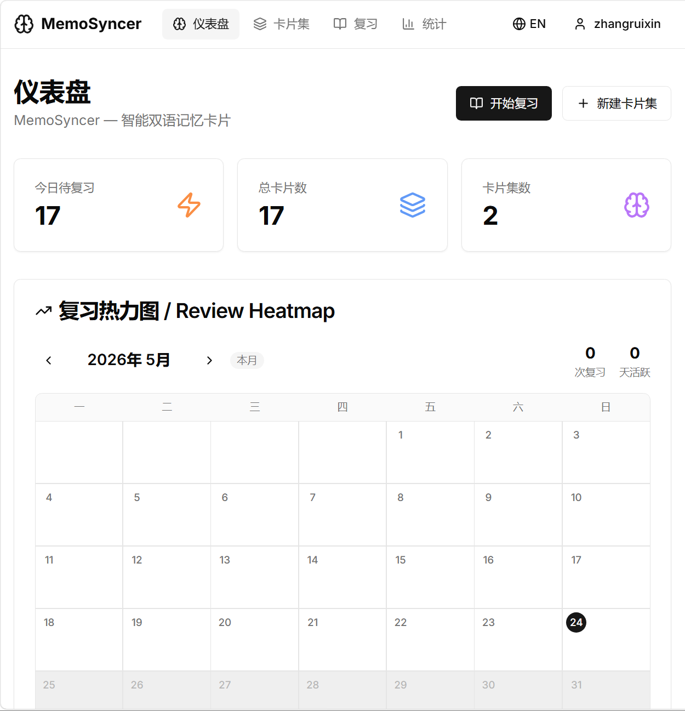
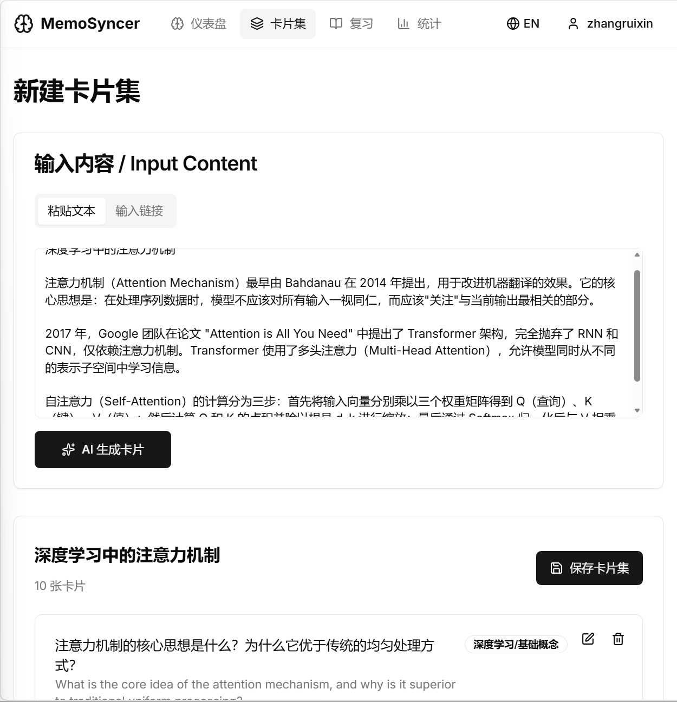
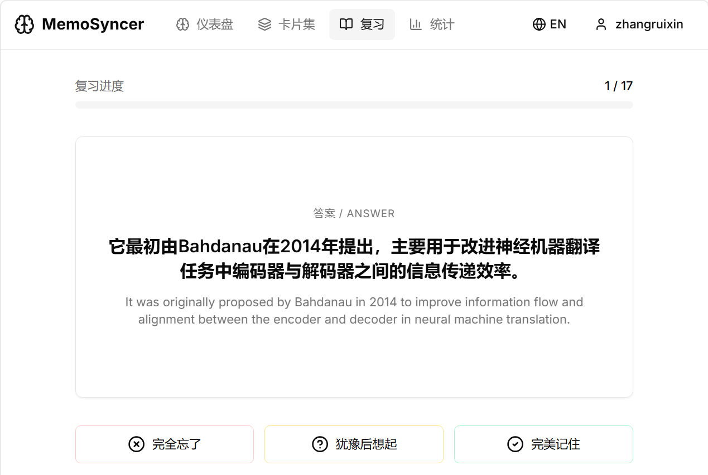
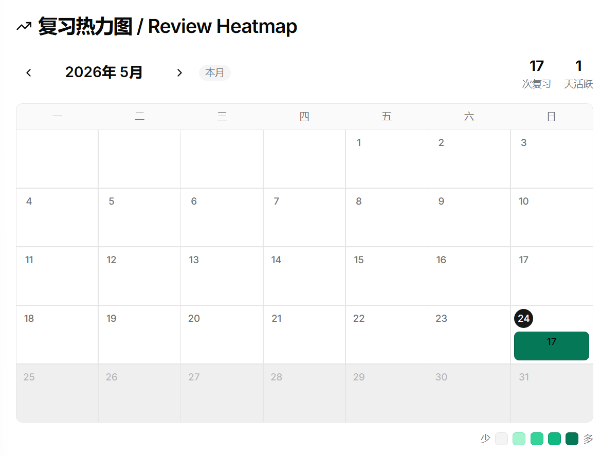

# MemoSyncer

<div align="center">

**智能双语记忆卡片知识库**

一个专为碎片化学习者设计的渐进式卡片复习网站。  
输入长文章或链接，AI 自动拆解为双语记忆卡，间隔重复算法驱动高效复习。

</div>

---

## 截图预览

<!-- 📸 截图位置 1：Dashboard 总览页（包含热力图、统计数据） -->
<!-- 文件名：screenshot-dashboard.png，放到 img/ 文件夹 -->
<p align="center">
  
  <br/>
  <em>Dashboard — 今日任务、复习热力图、卡片集一览</em>
</p>

<!-- 📸 截图位置 2：新建卡片集页面（输入文本 + AI 生成的卡片列表） -->
<!-- 文件名：screenshot-new-deck.png -->
<p align="center">
  
  <br/>
  <em>AI 卡片生成 — 粘贴文章，自动生成双语记忆卡</em>
</p>

<!-- 📸 截图位置 3：复习模式页面（卡片翻转 + 评分按钮） -->
<!-- 文件名：screenshot-review.png -->
<p align="center">
  
  <br/>
  <em>沉浸式复习 — 卡片翻转 + SM-2 间隔重复评分</em>
</p>

<!-- 📸 截图位置 4：月历热力图 -->
<!-- 文件名：screenshot-heatmap.png -->
<p align="center">
  
  <br/>
  <em>月历热力图 — 一目了然掌握学习节奏</em>
</p>

---

## 核心功能

### 1. AI 卡片自动提炼

输入一段长文章或学术内容，AI 自动提取关键知识点，生成 **中英双语记忆卡**。

- 每篇文章生成 8-15 张卡片
- 每张卡片包含：中文问题、英文问题、中文答案、英文答案、知识标签、难度等级
- 难度越高，答案越详细（基础题 30 字，难题 200 字）
- 支持直接编辑生成的卡片内容

### 2. SM-2 间隔重复算法

前端实现经典 **SM-2 算法**，根据用户评分自动计算下次复习时间：

| 评分 | 含义 | 行为 |
|------|------|------|
| 😊 记得 (5) | 完美回忆 | 间隔递增（1天 → 6天 → 15天 → ...） |
| 🤔 模糊 (3) | 犹豫后想起 | 间隔小幅递增 |
| 😅 忘了 (1) | 完全想不起 | 重置为 1 天后复习 |

### 3. 月历复习热力图

GitHub 风格的热力图，按月展示复习情况：

- 左右箭头切换月份
- 每天显示复习次数，颜色深浅反映活跃度
- 今日高亮标记
- 本月统计：总复习次数、活跃天数

### 4. 中英双语界面

支持中文 / English 一键切换，路由方案：`/zh/...` 和 `/en/...`

---

## 技术栈

| 类别 | 技术 |
|------|------|
| **前端框架** | Next.js 14 (App Router) |
| **UI 组件** | Tailwind CSS + Shadcn/ui |
| **后端/数据库** | Supabase (PostgreSQL + Auth) |
| **AI 模型** | 通义千问 (DashScope API) |
| **算法** | SM-2 间隔重复算法 |
| **国际化** | next-intl |
| **部署** | Vercel + Supabase Cloud |

---

## 项目结构

```
MemoSyncer/
├── src/
│   ├── app/
│   │   ├── [locale]/
│   │   │   ├── dashboard/       # Dashboard 总览
│   │   │   ├── decks/
│   │   │   │   ├── new/         # 新建卡片集（AI 生成）
│   │   │   │   └── [id]/        # 卡片集详情
│   │   │   ├── review/          # 复习模式
│   │   │   ├── stats/           # 统计页
│   │   │   └── (auth)/          # 登录/注册
│   │   └── api/
│   │       ├── generate/        # AI 生成卡片 API
│   │       └── review/          # 复习结果提交 API
│   ├── components/
│   │   ├── heatmap.tsx          # 月历热力图
│   │   ├── navbar.tsx           # 导航栏（含登录状态）
│   │   └── ui/                  # Shadcn UI 组件
│   ├── lib/
│   │   ├── sm2.ts               # SM-2 算法实现
│   │   └── supabase/            # Supabase 客户端配置
│   ├── messages/                # 国际化翻译文件
│   │   ├── zh.json
│   │   └── en.json
│   └── i18n/                    # 国际化配置
├── supabase-schema.sql          # 数据库建表脚本
└── .env.local.example           # 环境变量模板
```

---

## 本地运行

### 1. 克隆仓库

```bash
git clone https://github.com/amuuu2/MemoSyncer.git
cd MemoSyncer
```

### 2. 安装依赖

```bash
npm install
```

### 3. 配置环境变量

复制 `.env.local.example` 为 `.env.local`，填入你的密钥：

```bash
cp .env.local.example .env.local
```

```env
# Supabase
NEXT_PUBLIC_SUPABASE_URL=https://你的项目ID.supabase.co
NEXT_PUBLIC_SUPABASE_ANON_KEY=你的anon_key

# 通义千问 (DashScope)
QWEN_API_KEY=sk-你的DashScope密钥
QWEN_BASE_URL=https://dashscope.aliyuncs.com/compatible-mode/v1
QWEN_MODEL=qwen3.6-plus
```

### 4. 创建数据库表

1. 登录 [Supabase](https://supabase.com)，创建新项目
2. 进入 **SQL Editor**，粘贴 `supabase-schema.sql` 的内容并执行

### 5. 启动开发服务器

```bash
npm run dev
```

打开 http://localhost:3000 即可访问。

---

## 使用流程

```
注册/登录 → 新建卡片集 → 粘贴文章 → AI 生成卡片 → 保存 → 进入复习 → 评分 → 查看热力图
```

1. **注册账号** — 邮箱 + 密码注册
2. **新建卡片集** — 粘贴长文章，点击「AI 生成卡片」
3. **编辑卡片** — 生成后可修改问题、答案、删除不合适的卡片
4. **修改卡片集名称** — 点击标题直接编辑
5. **保存** — 卡片集写入数据库
6. **开始复习** — 卡片翻转显示答案，选择评分
7. **查看统计** — Dashboard 和统计页查看学习进度

---

## 数据库设计

| 表 | 说明 |
|----|------|
| `profiles` | 用户资料（关联 auth.users） |
| `decks` | 卡片集（一次输入生成一组） |
| `cards` | 单张记忆卡（双语问题+答案） |
| `reviews` | 复习记录（SM-2 算法状态） |

所有表启用 **Row Level Security**，用户只能访问自己的数据。

---

## 部署

### Vercel 一键部署

1. Fork 本仓库
2. 在 [Vercel](https://vercel.com) 导入项目
3. 添加环境变量（同 `.env.local`）
4. 部署完成

---

## 许可证

MIT License
